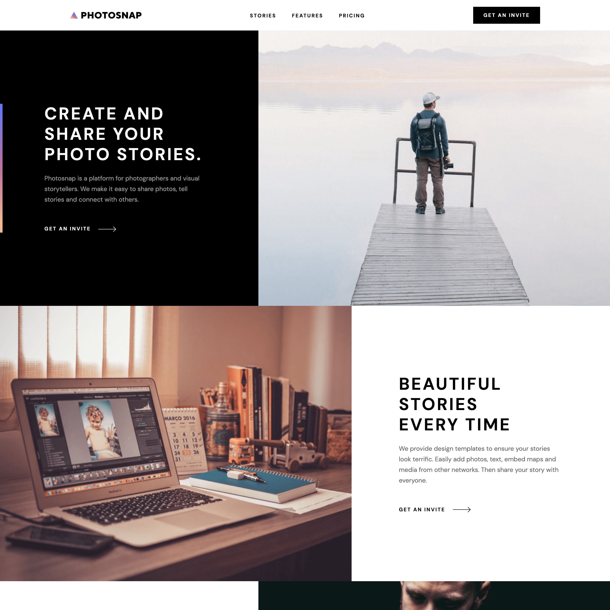

# Photosnap

A 4 pages website for a fictional photography platform

## Hi ! 👋

**Thanks for checking out this [project](https://davidyvon.github.io/photosnap-website/) !**

## General info

- Mobile First Responsive Design
- Mobile menu
- Interactive pricing cards
- Pricing table

## Built with

      

## Want to see more ?

**Check out my [portfolio](https://www.davidyvon.com) !**
